# 🏛️ Channapatna Namma Pride

An Android application focused on preserving the authenticity and cultural identity of traditional Channapatna toys through digital verification and artisan discovery.

---

# 📌 Overview

Channapatna Namma Pride is a modern Android application developed as part of the MindMatrix Industry Readiness Program under VTU.

The application helps users:
- Verify authenticity using QR codes
- Explore artisan information
- Discover handcrafted products
- Support local artisans

---

## ✨ Key Features

- 🧸 Explore authentic Channapatna toys
- 👨‍🎨 Discover verified artisan profiles
- 📍 Locate artisans through integrated maps
- 📖 Learn cultural stories and heritage impact
- 🔍 Smart toy search and catalog browsing
- ❤️ Save favorite toys for quick access
- ✅ Toy authenticity verification system
- 📷 QR Scanner integration for product details
- 🌱 Promote sustainable local craftsmanship

---

## 📸 App Gallery

<p align="center">
  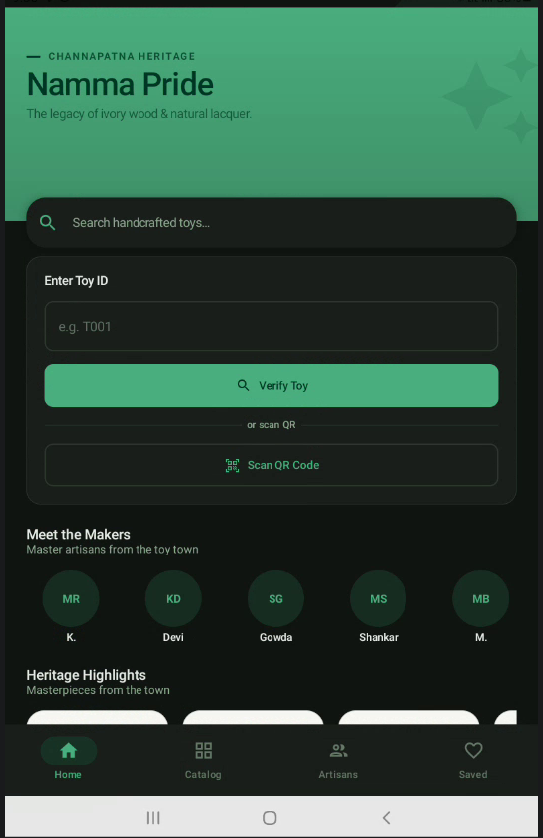
  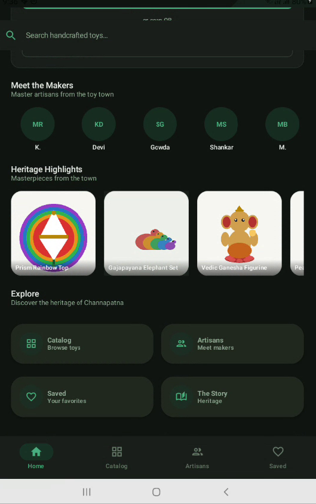
  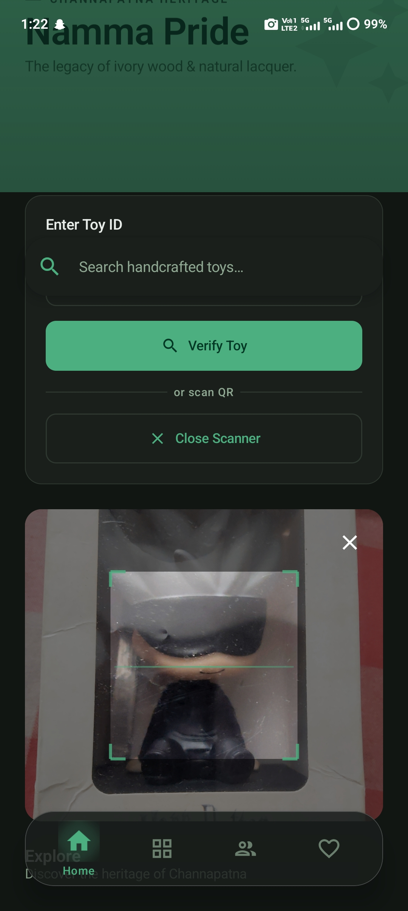
</p>

<p align="center">
  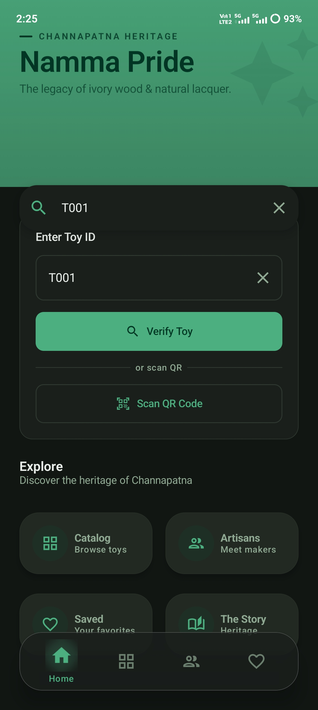
  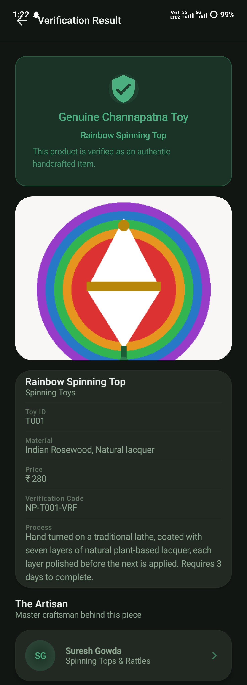
  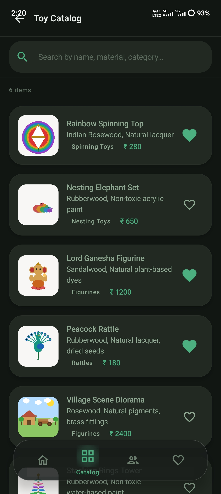
  
</p>

<p align="center">
  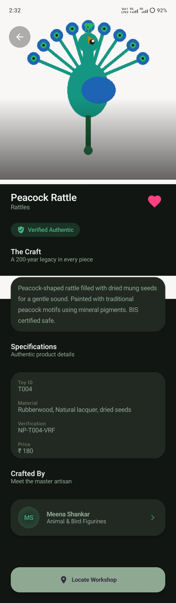
  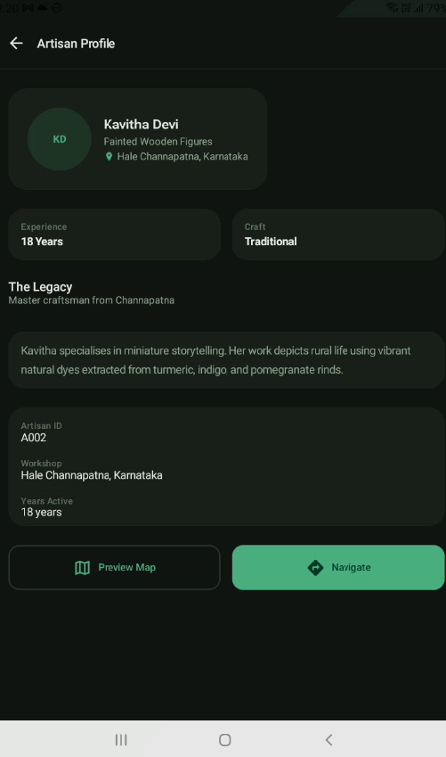
  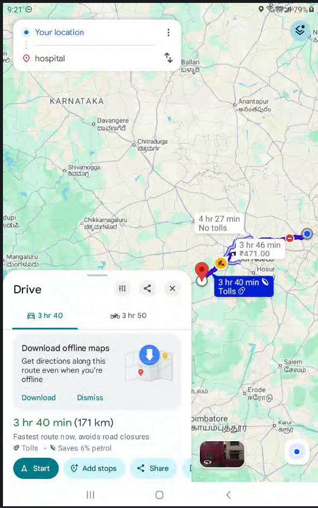
</p>

<p align="center">
  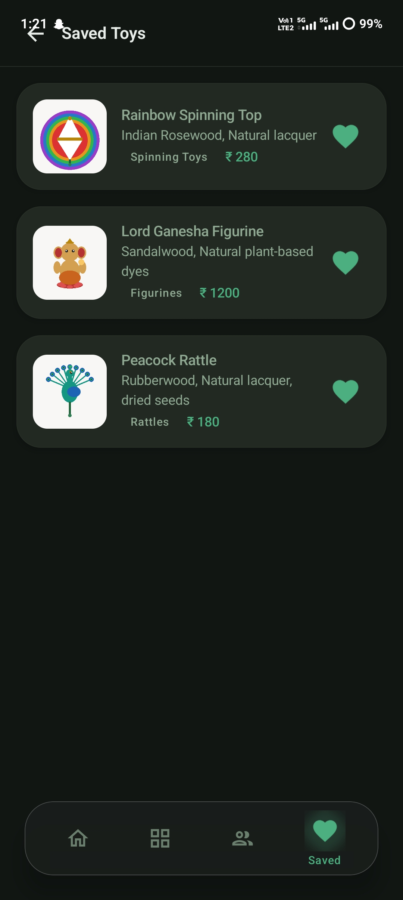
  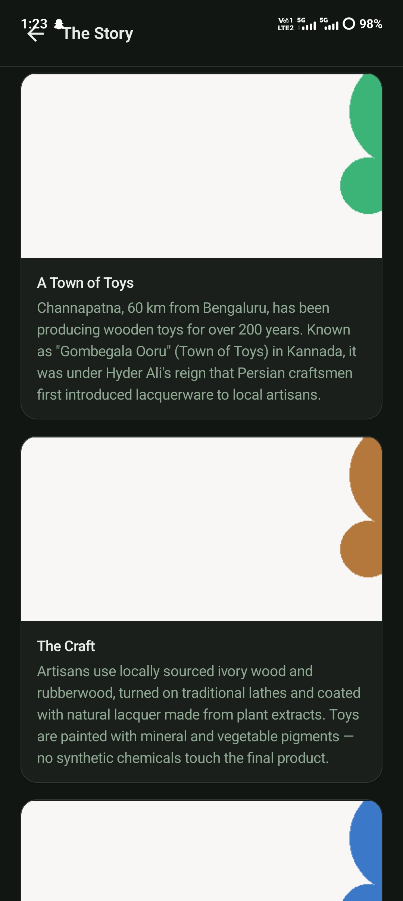
  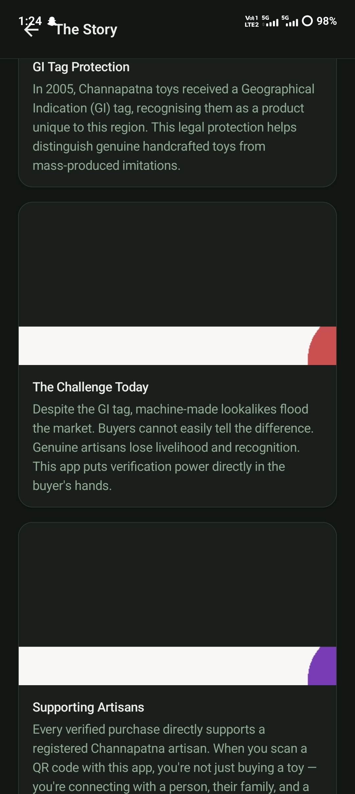
</p>
---

# 🛠️ Tech Stack

| Technology | Usage |
|------------|-------|
| Kotlin | Android Development |
| Jetpack Compose | UI |
| MVVM | Architecture |
| Firebase | Backend |
| Google Maps API | Location Services |
| Material 3 | UI Design |

---

# 🏗️ Architecture

The application follows MVVM (Model-View-ViewModel) architecture.

- UI Layer
- ViewModel Layer
- Repository Layer
- Firebase Integration
- Dependency Injection

---
# 🚀 Installation Guide

## Prerequisites
- Android Studio Hedgehog or above
- Kotlin support
- Firebase account
- Google Maps API key

## Clone Repository

```bash
git clone https://github.com/BHARGAVC1/channapatna-namma-pride.git
```

Open in Android Studio and run the project.

---

# 🔑 API Setup

## Local Setup
1. Copy `local.properties.example` to `local.properties`.
2. Add your Maps API key:
   ```properties
   MAPS_API_KEY=YOUR_API_KEY
   ```
3. Sync Gradle in Android Studio.

---

# 📂 Project Structure

```text
app/
├── ui/
├── viewmodel/
├── repository/
├── data/
├── navigation/
└── utils/
```

---

# 🎯 Future Enhancements

- AI-based product verification
- Multi-language support
- In-app artisan chat system
- Online ordering integration
- AR toy visualization
- Enhanced analytics dashboard

---

# 👨‍💻 Developer

**Bhargav C**

- VTU – Android App Development using Gen AI
- Team builders - Group G4 ( Capability Couch )
- Team Mavericks – Group G5 ( Leaders Group )
  

📧 bhargav27love@gmail.com

- GitHub: <a href="https://github.com/BHARGAVC1">BHARGAVC1</a>
- LinkedIn: <a href="https://www.linkedin.com/in/bhargav-c-a2a46535a">Bhargav C</a>

---

# 📜 License

This project is developed for educational and internship purposes under the MindMatrix Industry Readiness Program.
