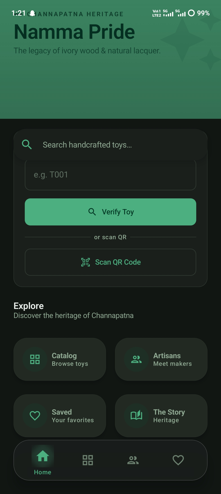
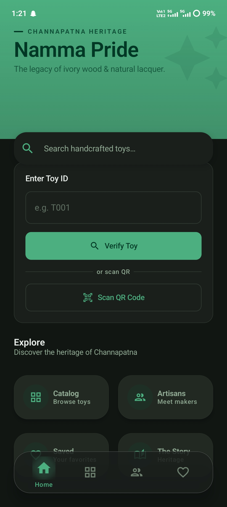
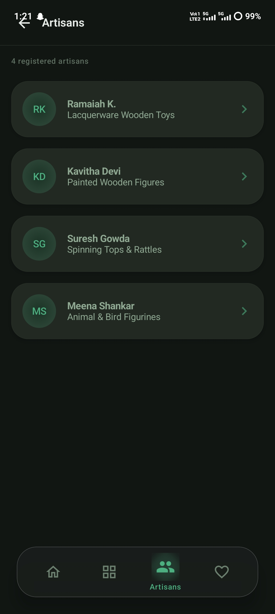
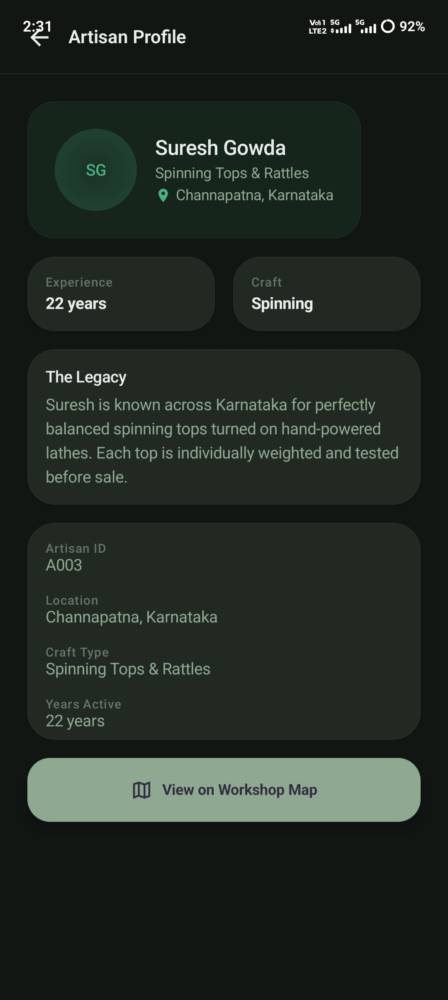
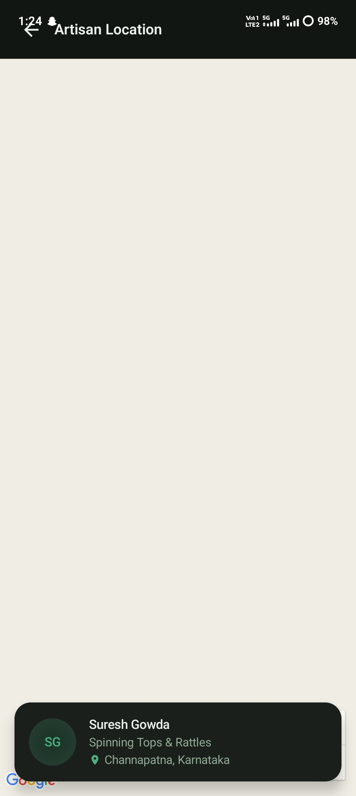

# 🏛️ Channapatna Namma Pride


An intelligent Android application designed to preserve the authenticity, cultural identity, and digital presence of traditional Channapatna toys through QR-based verification, artisan discovery, and heritage storytelling.

---

# 📌 Overview

**Channapatna Namma Pride** is a modern Android application developed under the **MindMatrix Industry Readiness Program** affiliated with **VTU**.

The application focuses on solving authenticity and visibility challenges faced by traditional Channapatna artisans by combining cultural preservation with modern Android technologies.

Users can:

- Verify authentic handcrafted toys
- Scan QR codes for instant product verification
- Explore artisan profiles and craftsmanship
- Discover Channapatna heritage stories
- Save favorite handcrafted products
- Locate artisan workshops using Google Maps
- Learn about GI-tag protection and toy-making traditions

The project aims to digitally empower local artisans while increasing awareness about Karnataka’s rich toy-making heritage.

---

# ❗ Problem Statement

Traditional Channapatna toys are an important cultural symbol of Karnataka and India’s handcrafted heritage. However, the industry currently faces several challenges:

- Difficulty identifying genuine handcrafted products
- Lack of digital visibility for local artisans
- Increasing fake and machine-made replicas
- Limited awareness among younger generations
- Absence of a centralized authenticity verification system

This project addresses these problems by building a smart Android platform that enables digital verification, artisan discovery, and cultural storytelling through a modern user experience.

---

# 🎯 Objectives

- Preserve the authenticity of Channapatna toys
- Digitally empower local artisans
- Promote GI-tag awareness
- Support cultural heritage preservation
- Simplify handcrafted product verification
- Increase tourism and artisan visibility
- Build a scalable Android platform for future innovation

---

# ✨ Key Features

## 🔍 QR-Based Toy Verification
Users can scan QR codes attached to products to instantly verify authenticity and view product details.

## 🧸 Product Catalog
Browse handcrafted toy collections with material information, category details, and pricing.

## 🧑‍🎨 Artisan Discovery
Explore artisan profiles, craftsmanship specialties, and years of experience.

## 🗺️ Workshop Location Integration
Locate artisan workshops directly using Google Maps integration.

## ❤️ Favorites System
Save favorite handcrafted products for quick future access.

## 📖 Heritage Story Section
Learn about the history, craft process, GI-tag protection, and cultural significance of Channapatna toys.

## ⚡ Modern Android UI
Smooth and responsive user experience built using Material 3 and Jetpack Compose.

## 🔐 Structured Architecture
Implemented using MVVM architecture with scalable and maintainable code organization.

---

# 🛠️ Tech Stack

| Technology | Purpose |
|---|---|
| Kotlin | Android Development |
| Jetpack Compose | Modern UI Toolkit |
| MVVM | Application Architecture |
| Firebase | Backend Services |
| Google Maps API | Location Services |
| Material 3 | UI Components |
| Android Studio | Development Environment |
| Git & GitHub | Version Control |

---

# 🏗️ System Architecture

The application follows a clean and scalable **MVVM (Model-View-ViewModel)** architecture.

```text
Presentation Layer (UI)
        ↓
ViewModel Layer
        ↓
Repository Layer
        ↓
Firebase / APIs / Local Storage
```

### Architecture Components

- **UI Layer** → Handles screens and user interaction
- **ViewModel Layer** → Manages application state and logic
- **Repository Layer** → Controls data operations
- **Firebase Layer** → Handles cloud-based data storage
- **Google Maps API** → Provides workshop location services

---

# 📂 Project Structure

```bash
app/
├── data/
├── di/
├── model/
├── navigation/
├── repository/
├── ui/
│   ├── components/
│   ├── screens/
│   └── theme/
├── utils/
├── viewmodel/
├── firebase/
└── MainActivity.kt

screenshots/
```

---

# 🚀 Installation Guide

## 📋 Prerequisites

Before running the project, ensure you have:

- Android Studio Hedgehog or above
- Android SDK installed
- Kotlin support enabled
- Firebase project setup
- Google Maps API key

---

# 🔧 Clone Repository

```bash
git clone https://github.com/BHARGAVC1/channapatna-namma-pride.git
```

---

# ▶️ Open Project

1. Open Android Studio
2. Click **Open Existing Project**
3. Select the cloned repository folder
4. Allow Gradle Sync to complete

---

# 🔑 Google Maps API Setup

Create or edit the `local.properties` file:

```properties
MAPS_API_KEY=YOUR_API_KEY
```

### Steps

1. Copy `local.properties.example` to `local.properties`
2. Add your Google Maps API key
3. Sync Gradle
4. Rebuild the project

---

# 🔥 Firebase Setup

1. Create a Firebase project
2. Download `google-services.json`
3. Place it inside:

```text
app/google-services.json
```

4. Sync Gradle and run the application

---

# ▶️ Run Application

- Connect Android device or emulator
- Click **Run ▶️** in Android Studio
- Install and launch the application

---

# 📸 Application Screenshots

## 🏠 Home Screen

| Main Dashboard | Search & Verification |
|---|---|
|  |  |

---

## 🔍 QR Verification System

| QR Scanner | Verification Result |
|---|---|
|  |  |

---

## 🧸 Toy Catalog & Details

| Toy Catalog | Toy Details |
|---|---|
|  |  |

---

## 🧑‍🎨 Artisan Discovery

| Artisan List | Artisan Profile |
|---|---|
|  |  |

| Workshop Location |
|---|
|  |

---

## ❤️ Favorites System

| Saved Toys |
|---|
|  |

---

## 📖 Cultural Story Section

| Heritage Story | Craft Information |
|---|---|
|  |  |

| GI Tag & Artisan Support |
|---|
|  |

---

# 🌍 Social Impact

This project contributes toward:

- Preservation of Karnataka’s cultural heritage
- Digital empowerment of artisans
- Promotion of authentic handmade products
- Increased tourism awareness
- Encouraging sustainable craftsmanship
- Supporting local traditional industries

---

# 📊 Future Enhancements

- 🤖 AI-powered fake product detection
- 🌐 Multi-language support
- ☁️ Cloud synchronization
- 📈 Analytics dashboard
- 🛒 Online artisan marketplace
- 🔔 Real-time notifications
- 🧠 AI-based recommendation engine
- 🎙️ Voice-assisted accessibility support

---

# 🧪 Testing & Optimization

The project has been developed with focus on:

- Smooth navigation
- Optimized UI rendering
- Responsive layouts
- Clean architecture practices
- Firebase integration testing
- QR verification flow testing
- API integration validation
- Performance optimization

---

# 📚 Learning Outcomes

Through this project, the following concepts were explored:

- Modern Android Development
- Jetpack Compose UI
- MVVM Architecture
- Firebase Integration
- QR Scanner Implementation
- Google Maps Integration
- Real-time Database Operations
- Clean Code Practices
- Material 3 Design System
- Git & GitHub Version Control

---

# 👨‍💻 Developer

## Bhargav C

VTU – Android App Development using Gen AI

### Teams

- Team Builders – Group G4 (Capability Couch)
- Team Mavericks – Group G5 (Leaders Group)

📧 Email: bhargav27love@gmail.com

🌐 GitHub: https://github.com/BHARGAVC1

💼 LinkedIn: https://www.linkedin.com/in/bhargav-c-a2a46535a

---

# 📜 License

This project is developed for educational, internship, and research purposes under the MindMatrix Industry Readiness Program.

---

# ⭐ Support

If you found this project useful, consider giving it a ⭐ on GitHub.

Your support helps encourage innovation, artisan empowerment, and preservation of India’s cultural heritage.
